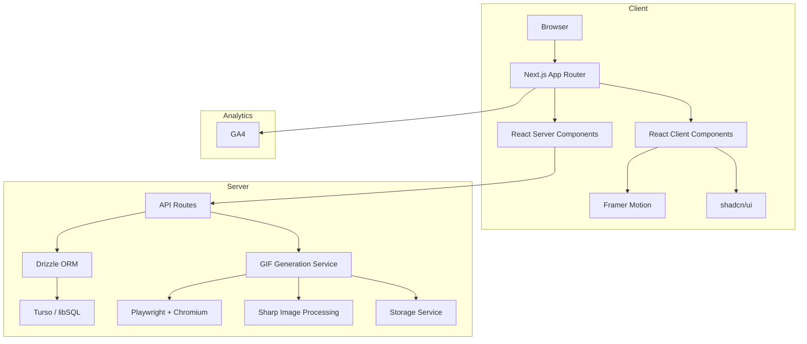
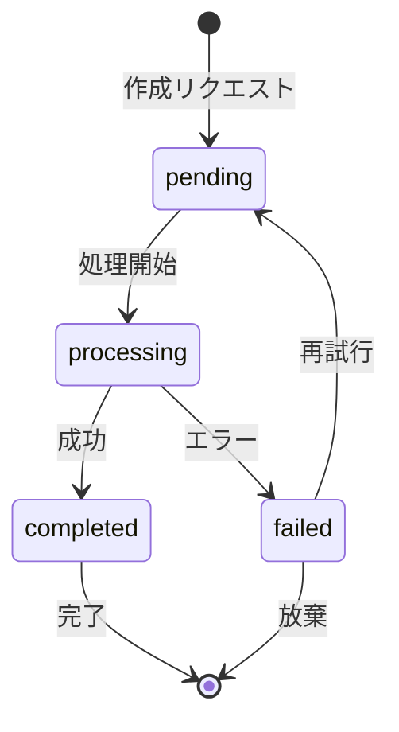
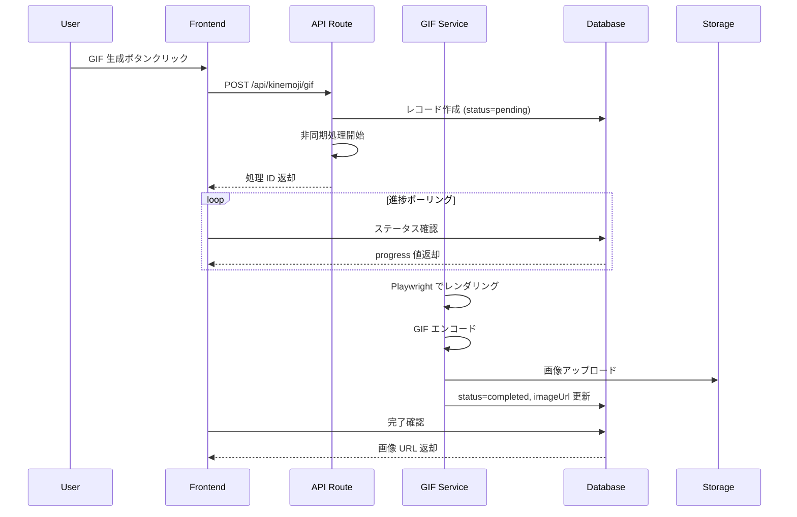
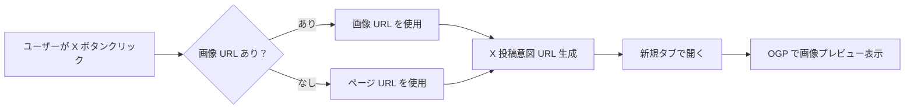

# 📘 Kinemoji (キネ文字) - Design Document

## 📋 概要

Kinemoji は、ブラウザ上でリアルタイムに動かす「インタラクティブな文字演出」を生成・共有するプラットフォームです。Framer Motion を活用した高品質なアニメーションと、サーバーサイド GIF 生成機能を組み合わせ、ユーザーが独自の「動く文字」を作成・共有できるようにします。

**バージョン**: 1.0.0  
**最終更新**: 2026-04-09

---

## 🎨 デザインシステム

### ブランドコンセプト

Kinemoji のデザインは、**「ミニマルでモダン、動きのある文字」**を表現します。veryman.jp のイメージを継承しつつ、独自の個性を打ち出します。

- **ミニマリズム**: 余計な装飾を排し、コンテンツ（動く文字）に集中できるデザイン
- **モダンさ**: 洗練されたタイポグラフィと、滑らかなアニメーション
- **コントラスト**: 黒と白の明確な対比で、視認性とインパクトを確保
- **アクセント**: オレンジ/レッド系のアクセントカラーで、活力と創造性を表現

### カラーパレット

#### 基本カラー

| 役割 | 色 | 使用例 |
|------|-----|--------|
| **Background (Light)** | `#FFFFFF` | 背景色（ライトモード） |
| **Background (Dark)** | `#0A0A0A` | 背景色（ダークモード） |
| **Foreground (Light)** | `#0A0A0A` | 文字色（ライトモード） |
| **Foreground (Dark)** | `#FAFAFA` | 文字色（ダークモード） |
| **Primary** | `#171717` | メインのアクション、ボタン |
| **Primary Foreground** | `#FAFAFA` | プライマリ上の文字 |
| **Secondary** | `#F5F5F5` | 補助的な背景 |
| **Secondary Foreground** | `#171717` | セカンダリ上の文字 |
| **Muted** | `#F5F5F5` | 無効状態、控えめな背景 |
| **Muted Foreground** | `#737373` | 補助的な文字 |
| **Accent** | `#FF4500` | ハイライト、重要な要素 |
| **Accent Foreground** | `#FFFFFF` | アクセント上の文字 |
| **Destructive** | `#EF4444` | エラー、削除アクション |
| **Border** | `#E5E5E5` | 境界線 |
| **Input** | `#E5E5E5` | 入力フィールドの境界 |
| **Ring** | `#A3A3A3` | フォーカスリング |

#### アクセントカラー（ブランドカラー）

| 色 | HEX | 使用例 |
|-----|-----|--------|
| **Kinemoji Orange** | `#FF4500` | CTA ボタン、ハイライト、アイコン |
| **Kinemoji Red** | `#DC2626` | エラー、緊急の通知 |
| **Kinemoji Yellow** | `#F59E0B` | 警告、注意喚起 |
| **Kinemoji Green** | `#10B981` | 成功、完了状態 |

### タイポグラフィ

#### フォントファミリー

| 用途 | フォント | 特徴 |
|------|----------|------|
| **Body / UI** | Montserrat | モダンで力強い欧文サンセリフ体 (veryman.jp 継承) |
| **Japanese** | Noto Sans JP (Bold) | インパクトのある和文サンセリフ体。基本は太字を使用。 |
| **Accent JP** | Hina Mincho | 伝統的で洗練された明朝体 (veryman.jp 継承) |
| **Mono** | Geist Mono | コード、数値表示 |
| **Heading** | Montserrat (Black/Bold) | インパクトのある見出し |

#### フォントサイズ

| 要素 | サイズ | ラインハイト |
|------|--------|--------------|
| **H1** | `2.5rem` (40px) | `1.2` |
| **H2** | `2rem` (32px) | `1.3` |
| **H3** | `1.5rem` (24px) | `1.4` |
| **H4** | `1.25rem` (20px) | `1.5` |
| **Body** | `1rem` (16px) | `1.6` |
| **Small** | `0.875rem` (14px) | `1.5` |

### スペース（間隔）

| 値 | サイズ | 使用例 |
|-----|--------|--------|
| `xs` | `0.25rem` (4px) | 微調整 |
| `sm` | `0.5rem` (8px) | 小さな間隔 |
| `md` | `1rem` (16px) | 標準的な間隔 |
| `lg` | `1.5rem` (24px) | 大きな間隔 |
| `xl` | `2rem` (32px) | 非常に大きな間隔 |
| `2xl` | `3rem` (48px) | セクション間の間隔 |

### レーディング（境界線・角丸）

| 要素 | 値 |
|------|-----|
| **Border Radius (SM)** | `0.375rem` (6px) |
| **Border Radius (MD)** | `0.5rem` (8px) |
| **Border Radius (LG)** | `0.75rem` (12px) |
| **Border Radius (XL)** | `1rem` (16px) |
| **Border Width** | `1px` |

### アニメーション

#### トランジション

| 要素 | 時間 | イージング |
|------|------|------------|
| **Button Hover** | `200ms` | `ease-out` |
| **Modal Fade** | `300ms` | `ease-in-out` |
| **Slide In** | `400ms` | `ease-out` |

#### Framer Motion 設定

```typescript
// 共通のアニメーション設定
const fadeIn = {
  hidden: { opacity: 0, y: 20 },
  visible: { opacity: 1, y: 0, transition: { duration: 0.4 } }
};

const scaleIn = {
  hidden: { opacity: 0, scale: 0.9 },
  visible: { opacity: 1, scale: 1, transition: { duration: 0.3 } }
};
```

### コンポーネントスタイル

#### ボタン

| 種類 | 背景色 | 文字色 | ホバー |
|------|--------|--------|--------|
| **Primary** | `#171717` | `#FAFAFA` | `#0A0A0A` |
| **Secondary** | `#F5F5F5` | `#171717` | `#E5E5E5` |
| **Accent** | `#FF4500` | `#FFFFFF` | `#DC2626` |
| **Outline** | 透明 | `#171717` | `#F5F5F5` |

#### カード

| 要素 | 背景色 | 境界線 | 角丸 |
|------|--------|--------|------|
| **Card** | `#FFFFFF` | `#E5E5E5` | `0.75rem` |
| **Card (Dark)** | `#171717` | `#404040` | `0.75rem` |

---

## 🏗️ アーキテクチャ概要

### システム全体図



### 技術スタック

| カテゴリ | 技術 | 目的 |
|----------|------|------|
| **フレームワーク** | Next.js 15 (App Router) | フルスタック React フレームワーク |
| **UI ライブラリ** | React 19 | UI コンポーネント基盤 |
| **アニメーション** | Framer Motion | 高品質なテキストアニメーション |
| **UI コンポーネント** | shadcn/ui | カスタマイズ可能な UI コンポーネント |
| **データベース** | Turso (libSQL) | エッジ対応の SQLite データベース |
| **ORM** | Drizzle ORM | 型安全なデータベース操作 |
| **GIF 生成** | Playwright + chromium | サーバーサイド GIF レンダリング |
| **画像処理** | Sharp | 画像リサイズ・最適化 |
| **認証** | Auth.js (NextAuth) | Google OAuth + Credentials |
| **分析** | GA4 (Google Analytics 4) | ユーザー行動分析 |
| **デプロイ** | Netlify | サーバーレスホスティング |

---

## 📁 ディレクトリ構造とコンポーネント設計

### 階層化されたアーキテクチャ

```
src/
├── app/                          # Next.js App Router (ルート定義)
│   ├── layout.tsx                # ルートレイアウト (Navigation, Footer, GA4)
│   ├── page.tsx                  # ホームページ
│   ├── (auth)/                   # 認証グループ
│   ├── (user)/                   # ユーザー固有機能
│   ├── admini/                   # 管理者ダッシュボード
│   ├── api/                      # API ルート
│   │   ├── auth/                 # 認証エンドポイント
│   │   ├── kinemoji/gif/         # GIF 生成エンドポイント
│   │   └── posts/                # 投稿管理
│   └── kinemoji/                 # メイン機能
│       ├── [id]/                 # 詳細ページ
│       ├── list/                 # 一覧ページ
│       ├── new/                  # 新規作成
│       └── render/               # GIF 描画用ページ
│
├── components/                   # React コンポーネント
│   ├── atomic/                   # 原子コンポーネント (Button, Input など)
│   ├── layout/                   # レイアウトコンポーネント
│   │   ├── Navigations.tsx       # ナビゲーションバー (Client Component)
│   │   └── Footer.tsx            # フッター
│   ├── organisms/                # 複合コンポーネント
│   │   ├── kinemoji/             # アニメーション表示コンポーネント
│   │   │   ├── LupinDisplay.tsx  # ルパン三世風演出
│   │   │   └── StandardDisplay.tsx # 標準演出
│   │   └── kinemoji-copy-buttons.tsx # 共有・投稿ボタン
│   ├── pages/                    # ページロジックコンポーネント
│   │   ├── kinemoji-list-page.tsx    # 一覧ページロジック
│   │   └── kinemoji-new-page.tsx     # 新規作成ページロジック
│   └── ui/                       # shadcn/ui コンポーネント
│
├── service/                      # ビジネスロジック層
│   ├── kinemoji-service.ts       # CRUD 操作
│   ├── kinemoji-gif-service.ts   # GIF 生成エンジン
│   └── kinemoji-upload-service.ts # 画像アップロード
│
├── db/                           # データベース
│   └── schema/
│       └── index.ts              # Drizzle スキーマ定義
│
├── lib/                          # 共通ライブラリ
│   ├── turso/                    # Turso クライアント
│   └── utils/                    # ユーティリティ関数
│
├── types/                        # TypeScript 型定義
└── auth.ts                       # Auth.js 設定
```

### コンポーネント設計原則

#### Server Component vs Client Component

| 種類 | 使用箇所 | 例 |
|------|----------|-----|
| **Server Component** | データ取得、SEO 向けメタデータ、静的レンダリング | [`page.tsx`](src/app/kinemoji/list/page.tsx), [`layout.tsx`](src/app/layout.tsx) |
| **Client Component** | ユーザーインタラクション、ステート管理、ブラウザ API | [`Navigations.tsx`](src/components/layout/Navigations.tsx), [`kinemoji-copy-buttons.tsx`](src/components/organisms/kinemoji-copy-buttons.tsx) |

**重要な設計判断**:
- `"use client"` ディレクティブは、インタラクションが必要なコンポーネントにのみ適用
- データ取得は Server Component で行い、Client Component に props として渡す
- 認証状態の表示は Client Component で処理

---

## 🗄️ データベース設計

### kinemojis テーブル

```typescript
export const kinemojis = sqliteTable("kinemoji", {
  id: text("id").notNull().primaryKey(),
  shortId: text("short_id").notNull().unique(),
  text: text("text").notNull(),
  parameters: text("parameters"), // JSON 形式でアニメーション設定
  imageUrl: text("image_url"),
  
  // GIF 生成ステータス管理
  status: text("gif_status", {
    enum: ["pending", "processing", "completed", "failed"],
  }).default("pending"),
  progress: integer("gif_progress").default(0),
  error: text("gif_error"),
  
  // 監査用
  creatorId: text("creator_id"),
  createdAt: integer("created_at", { mode: "timestamp_ms" }).notNull(),
  updatedAt: integer("updated_at", { mode: "timestamp_ms" }),
});
```

### ステータス遷移図



---

## 🔄 データフロー

### GIF 生成フロー



### X (Twitter) 投稿フロー



**設計判断**: X 投稿時には、直接画像 URL を渡すのではなく、**ページ URL** を使用します。これにより、X が OGP メタデータから画像を抽出し、リッチなプレビューカードを表示できます。

---

## 🎨 アニメーションエンジン

### LupinDisplay (ルパン三世風)

- **特徴**: 一文字ずつ表示し、最後に全体が表示される演出
- **実装**: Framer Motion の `staggerChildren`を使用
- **GIF 最適化**: 各文字の表示タイミングを正確に制御し、静止画キャプチャ漏れを防止

### StandardDisplay (標準演出)

- **特徴**: 方向（上下左右）、ズーム、フェードなどの標準アニメーション
- **カスタマイズ**: ユーザーがパラメータを調整可能
- **パフォーマンス**: GPU アクセラレーションを活用

---

## 🔐 認証設計

### 現状のステータス

認証機能は実装済みですが、現在は以下の理由で無効化されています:

1. **開発中の簡略化**: 現在の開発フェーズでは認証を必要としない
2. **エラー回避**: `auth()` 関数の呼び出しによるランタイムエラーを防止

### 将来的な実装

```typescript
// src/app/layout.tsx (将来の予定)
import { auth } from "@/auth";

export default async function RootLayout({ children }) {
  const session = await auth();
  
  return (
    <Navigation session={session} signInAction={signIn} signOutAction={signOut}>
      {children}
    </Navigation>
  );
}
```

**注意**: 認証を有効化する際は、以下の点に注意してください:
- `auth()` はサーバーコンポーネントでのみ呼び出し可能
- Client Component には `session` を props として渡す
- 保護が必要なページにはミドルウェアを設定

---

## 📊 分析・モニタリング

### GA4 統合

```typescript
// src/app/layout.tsx
import { GoogleAnalytics } from "@next/third-parties/google";

<GoogleAnalytics gaId="G-J2G39C7PZZ" />
```

**追跡対象**:
- ページビュー
- ボタンクリック（GIF 生成、共有、投稿）
- ユーザーフロー

---

## 🚀 今後の拡張計画

### 優先度：高

1. **背景機能の完全実装**
   - 現在の `status`/`progress` フィールドを活用
   - フロントエンドでのポーリング実装
   - WebSocket によるリアルタイム更新（将来的に）

2. **X 投稿の OGP 最適化**
   - メタデータの詳細化
   - 画像サイズの最適化

3. **認証機能の有効化**
   - 現在のダミー実装から本番環境向けへ移行

### 優先度：中

4. **スタート画面の再設計**
   - 導入チュートリアル
   - 例の提示

5. **パフォーマンス最適化**
   - 画像キャッシュ
   - CDN 統合

---

## 🔗 関連ドキュメント

- [README.md](README.md) - プロジェクト概要、変更履歴、TODO
- [AGENTS.md](AGENTS.md) - AI エージェント向けガイドライン

---

**作成者**: Roo (Architect Mode)  
**ステータス**: 草案（調整中）
